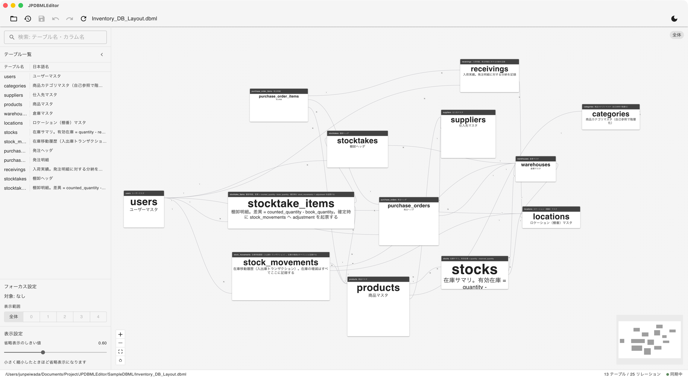

# JPDBMLEditor

[日本語版 README はこちら](README.md) | **[Website & downloads](https://junpeiwada.github.io/JPDBMLEditor/)**

A desktop viewer / editor for [DBML](https://dbml.dbdiagram.io/home) (Database Markup Language), built with Tauri.



Existing VSCode extensions render ER diagrams poorly and the VSCode shell feels heavy for this purpose. JPDBMLEditor is a standalone, lightweight desktop app focused on making it comfortable to **view, arrange, and lightly edit** DBML files — while you keep using VSCode (or any editor) for full text editing.

## Features

- **Full ER diagram view** — parses `.dbml` with the official `@dbml/core` parser and renders all tables and relationships with automatic layout (ELK.js + React Flow).
- **Search filtering** — an always-visible search field matches both table names and column names; matching columns are highlighted inside their tables.
- **Neighborhood focus** — click a table to show only the tables connected to it via relationships, with an adjustable hop count (1 hop by default).
- **Inline editing** — add, edit, move, and delete columns and notes directly on the diagram.
- **Format-preserving minimal edits** — changes are applied as minimal text edits to the original source, preserving comments, ordering, and formatting instead of regenerating the whole file.
- **Explicit save + unlimited Undo/Redo** — edits stay in memory until you save explicitly (Save button / Cmd+S). Undo/Redo via Cmd+Z / Cmd+Shift+Z.
- **Manual reload** — no file watching; changes made externally (e.g. in VSCode) are pulled in with a reload button. A confirmation dialog guards against discarding unsaved edits.
- **Layout sidecar file** — table positions and column widths are stored in a `foo.jpdbml.json` file next to the `.dbml`, so the DBML source itself is never polluted with visual state. If the sidecar is missing or broken, the app falls back to automatic layout.
- **IME-aware inputs** — all text fields are carefully guarded for Japanese IME composition (Enter/Esc handling).

## Install

Pick your OS on the [download page](https://junpeiwada.github.io/JPDBMLEditor/#download), or grab the
files directly from the [Releases page](https://github.com/Junpeiwada/JPDBMLEditor/releases/latest):

| OS | File | Notes |
| --- | --- | --- |
| macOS (Apple Silicon) | `JPDBMLEditor_x.y.z_aarch64.dmg` | M1/M2/M3… Macs |
| macOS (Intel) | `JPDBMLEditor_x.y.z_x64.dmg` | Intel Macs |
| Windows | `JPDBMLEditor_x.y.z_x64-setup.exe` | 64-bit |

Once installed, the app **updates itself**: it checks for new versions on launch, and you can
also check manually from the toolbar (the "check for updates" button). When an update is found,
you're asked before it downloads and restarts.

### First launch (unsigned build)

Builds are not code-signed yet, so the OS shows a warning the first time. This is expected —
just allow it once:

- **macOS**: The `.dmg` opens; drag **JPDBMLEditor** into **Applications**. On first launch you'll
  see "JPDBMLEditor cannot be opened because the developer cannot be verified." Do **not** click
  "Move to Trash" — instead **right-click (or Control-click) the app → Open**, then confirm **Open**
  in the dialog. You only need to do this once. (Alternatively: System Settings → Privacy & Security
  → "Open Anyway".)
- **Windows**: SmartScreen may show "Windows protected your PC." Click **More info → Run anyway**.

## Tech Stack

| Area | Choice |
| --- | --- |
| Shell | Tauri 2 + Vite + TypeScript |
| UI | React 19 + MUI (toasts via notistack) |
| DBML parser | `@dbml/core` |
| Diagram | React Flow (`@xyflow/react`) + ELK.js auto layout |
| E2E tests | Playwright (with Tauri IPC mock) |

## Getting Started

### Prerequisites

- Node.js ≥ 18
- Rust toolchain (for Tauri)

### Development

```bash
npm install

# Run as a desktop app (recommended)
npm run tauri dev

# Frontend only (Vite dev server)
npm run dev
```

### Build

```bash
npm run tauri build
```

### Tests

```bash
npm run test:e2e
```

## Releasing

Releases are built by GitHub Actions ([.github/workflows/release.yml](.github/workflows/release.yml)).
Pushing a tag that starts with `v` (e.g. `v0.1.0`) triggers builds for macOS
(Apple Silicon + Intel) and Windows (NSIS `.exe`), and attaches the installers to a
**draft** GitHub Release.

A helper script bumps the version and pushes the tag in one go. Run it from VSCode
("Run Task" → "release") or the terminal:

```bash
npm run release
```

It shows the current version, suggests the next patch (e.g. `0.1.0` → `0.1.1`) as the default,
then bumps `package.json` / `src-tauri/tauri.conf.json` / `src-tauri/Cargo.toml`, commits, and
pushes `main` and the tag (the tag push starts the release build).

Then, on the GitHub Releases page, review the assets and **Publish** the draft. Before
publishing, open `latest.json` and confirm it contains a `platforms` entry for **every** target
(`darwin-aarch64`, `darwin-x86_64`, `windows-x86_64`) — the three build jobs run in parallel and
write `latest.json` independently, so a missing entry means that platform will not receive the
update.

> **Auto-update requires a published release.** The updater fetches
> `releases/latest/download/latest.json`, which only resolves for the latest *published*
> release — a draft is invisible to it. Publishing is therefore mandatory for updates to
> reach users.

### Notes

- **Code signing.** Builds are currently **unsigned** (no Apple Developer Program). On first
  launch users will see a Gatekeeper / SmartScreen warning and must explicitly allow the app.
  The workflow already contains a commented-out env block for Apple signing/notarization —
  uncomment it and register the six `APPLE_*` secrets to enable it later.
- **Update signing keys.** Auto-update artifacts are signed with a minisign key pair
  (unrelated to Apple signing, and free). The **private** key lives in the
  `TAURI_SIGNING_PRIVATE_KEY` GitHub secret; the matching **public** key is committed in
  `src-tauri/tauri.conf.json` (`plugins.updater.pubkey`). These two must stay a pair — if they
  drift, every client will reject updates with a signature error.
- **Intel macOS** is cross-compiled on an Apple Silicon runner and is not routinely tested on
  real Intel hardware.

## Project Structure

```
src/                 # Frontend (Vite + TS + React)
├── parser/          # @dbml/core wrapper, internal model conversion
├── graph/           # Adjacency graph, N-hop traversal
├── layout/          # ELK.js auto layout
├── view/            # React Flow nodes/edges, search UI, panels
├── edit/            # Minimal-edit logic (format-preserving)
└── meta/            # .jpdbml.json sidecar read/write
src-tauri/           # Tauri (Rust: file I/O)
e2e/                 # Playwright E2E tests
Docs/                # Design documents (Japanese)
SampleDBML/          # Local-only DBML samples for testing (gitignored, not included in the repo)
```

## Documentation

Design documents live in [Docs/](Docs/) (written in Japanese), including the overall design ([全体設計.md](Docs/全体設計.md)), UI design ([UI設計.md](Docs/UI設計.md)), and the implementation plan ([実装計画.md](Docs/実装計画.md)).

## License

[MIT](LICENSE)
